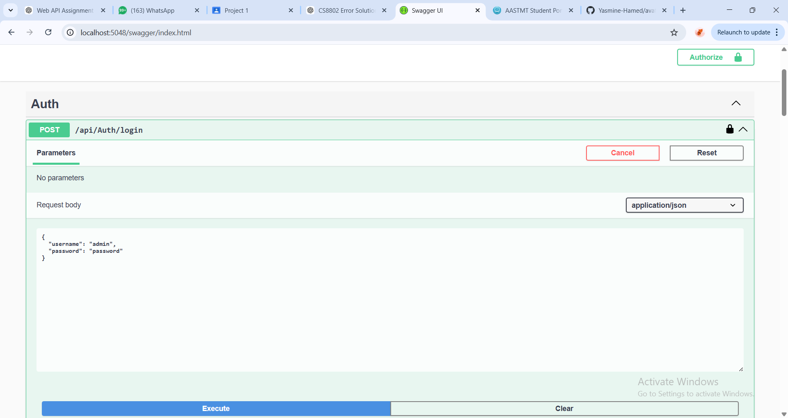
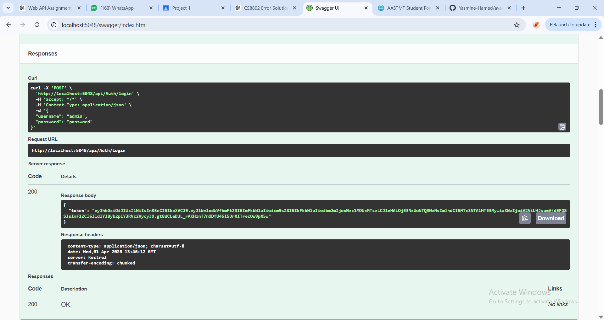
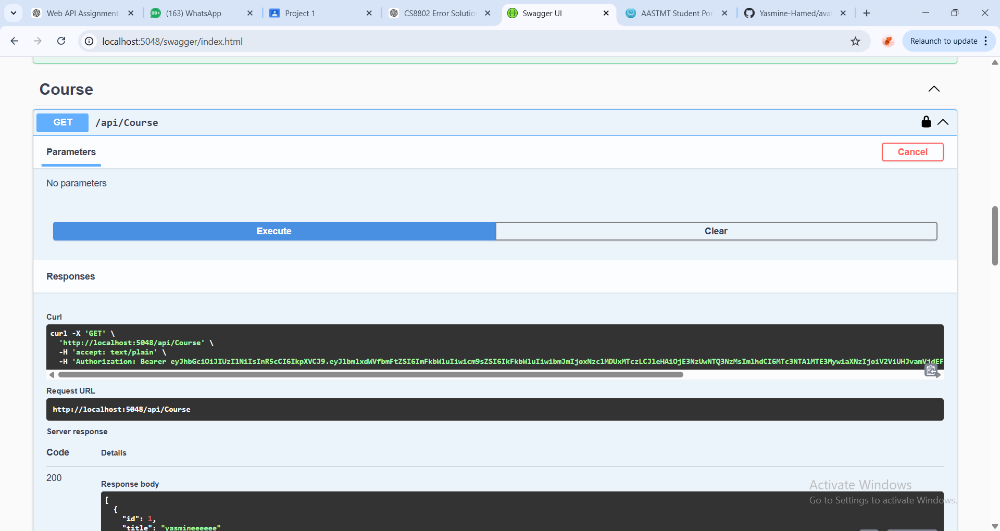
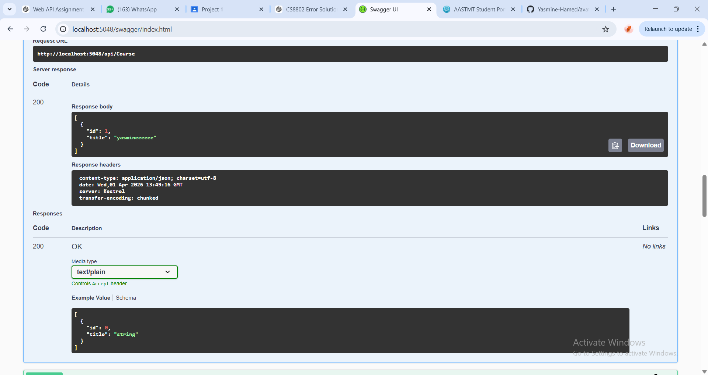
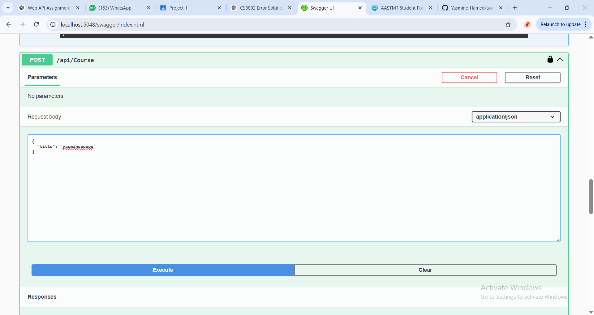
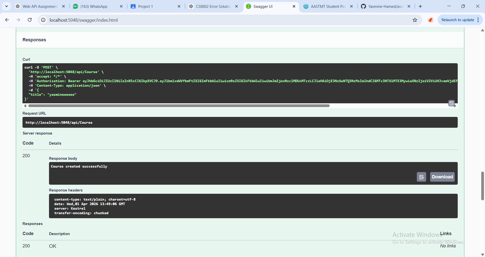
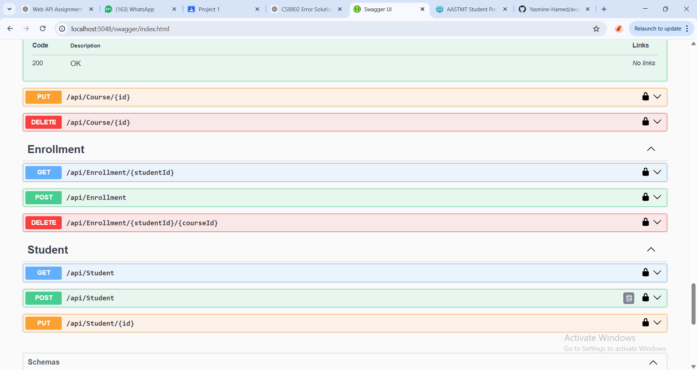
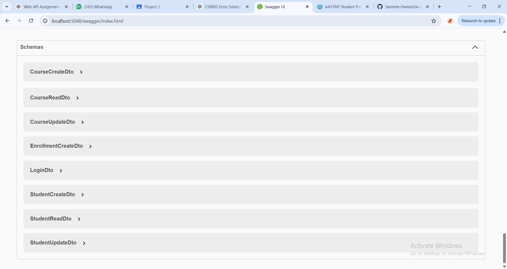

# webproject

## Overview

This is an ASP.NET Core Web API project that manages Students, Courses, Enrollments, and Instructors via REST API endpoints. It uses Entity Framework Core for SQL Server persistence and JWT-based authentication.

## Technologies Used

- .NET 9 (ASP.NET Core)
  - Web API framework for building RESTful services.
- Entity Framework Core
  - ORM to manage SQL Server database models and migrations.
- SQL Server
  - Relational database used through the `DefaultConnection` string in `appsettings.json`.
- JWT (JSON Web Tokens)
  - Token-based stateless authentication scheme that secures API endpoints.
- Swagger / OpenAPI
  - API documentation and interactive testing UI.
- ASP.NET Core Dependency Injection
  - Scoped services for modular business logic (`StudentService`, `CourseService`, `EnrollmentService`).

## Prerequisites

- Windows or any OS supported by .NET 9
- .NET 9 SDK installed
- SQL Server instance accessible (localdb or remote)
- Optional: Visual Studio 2022/2023, VS Code

## Setup

1. Clone this repository or open it in your IDE.
2. Configure connection string in `appsettings.json`:

```json
"ConnectionStrings": {
  "DefaultConnection": "Server=(localdb)\\mssqllocaldb;Database=WebProjectDb;Trusted_Connection=True;MultipleActiveResultSets=true"
}
```

3. Configure JWT settings in `appsettings.json`:

```json
"Jwt": {
  "Issuer": "your-issuer",
  "Audience": "your-audience",
  "Key": "your-secret-key-should-be-long"
}
```

4. Apply database migrations (from repository root):

```powershell
dotnet ef database update
```

## Run

1. Restore packages:

```powershell
dotnet restore
```

2. Build the project:

```powershell
dotnet build
```

3. Run the app:

```powershell
dotnet run
```

4. Open Swagger (default development URL):

- `https://localhost:5001/swagger` or as shown in console.

## Database Migrations

This repository includes EF Core migrations under `Migrations/`, starting with:

- `20260331153705_Initial` (initial schema)
- `20260331173341_AddInstructorEntities` (instructor relationships)

Apply migrations:

```powershell
dotnet ef database update
```

## API Endpoint Documentation

### Auth
- `POST /api/Auth/login` - credentials in JSON body, returns `{ token }` for bearer auth

### Course
- `GET /api/Course` - list courses
- `GET /api/Course/{id}` - course by id
- `POST /api/Course` - create course with `CourseCreateDto`
- `PUT /api/Course/{id}` - update course with `CourseUpdateDto`
- `DELETE /api/Course/{id}` - delete course

### Enrollment
- `GET /api/Enrollment/{studentId}` - get student enrollments
- `POST /api/Enrollment` - create enrollment with `EnrollmentCreateDto`
- `DELETE /api/Enrollment/{studentId}/{courseId}` - remove enrollment

### Student
- `GET /api/Student` - list students
- `GET /api/Student/{id}` - student by id
- `POST /api/Student` - create student with `StudentCreateDto`
- `PUT /api/Student/{id}` - update student with `StudentUpdateDto`

### Instructor
- `GET /api/Instructor` - list instructors
- `GET /api/Instructor/{id}` - instructor by id
- `POST /api/Instructor` - create instructor with `InstructorCreateDto` (Admin only)
- `PUT /api/Instructor/{id}` - update instructor with `InstructorUpdateDto` (Admin only)
- `DELETE /api/Instructor/{id}` - delete instructor (Admin only)

## Swagger / UI Screenshots

The following screenshots demonstrate the app running and endpoint usability in Swagger UI. Save and commit these images in `README-images/` (case-sensitive path on GitHub: `README-images`, not `readme-images`).

1. `README-images/1.png` - login request sample and JWT response
2. `README-images/2.png` - `/api/Auth/login` request body in Swagger
3. `README-images/3.png` - GET `/api/Course` response
4. `README-images/4.png` - POST `/api/Course` request sample
5. `README-images/5.png` - schema DTO tree in Swagger
6. `README-images/6.png` - endpoints listing with required auth lock
7. `README-images/7.png` - executing GET `/api/Course` with bearer header
8. `README-images/8.png` - successful course creation response



## How to use JWT in Swagger

1. Run the API and open Swagger UI at `https://localhost:5001/swagger`.
2. Expand `Auth` -> `POST /api/Auth/login`.
3. Send body with:

```json
{
  "username": "admin",
  "password": "password"
}
```

4. Copy token from response:

```json
{ "token": "<JWT>" }
```

5. Click `Authorize` (lock icon) on Swagger page.
6. Add header value: `Bearer <JWT>`.
7. Click `Authorize` and then `Close`.
8. Swagger will include JWT in `Authorization` header for all protected requests.

9. Execute protected endpoints such as `GET /api/Course` and `POST /api/Course` (Admin required).

10. To revoke, click `Authorize` -> `Logout`.















## JWT Authentication

This project uses JWT Bearer authentication with role-based authorization.

- `AuthController` (`POST /api/Auth/login`) returns a JWT token for valid credentials (`admin`/`password`).
- The JWT payload includes `Name` and `Role` claims (e.g., `Admin`).
- In `Program.cs`, `AddAuthentication` uses `JwtBearerDefaults.AuthenticationScheme` with issuer, audience, and signing key validation.
- Role-based rules:
  - `CourseController`: `GET` for any authenticated user; `POST`, `PUT`, `DELETE` for `Admin` only.
  - `StudentController`: `GET` for any authenticated user; `POST` for `Admin`; `PUT` for `Admin` or `Instructor`.
  - `EnrollmentController`: `GET` for any authenticated user; `POST`/`DELETE` for `Admin` or `Instructor`.

## Why HTTP-only cookies are an industry standard for authentication security

1. HTTP-only cookies cannot be read by JavaScript in the browser (`HttpOnly=true`).
   - This strongly reduces risk of client-side script theft via XSS (cross-site scripting).

2. They can support secure flags (`Secure=true`, `SameSite=Strict/Lax`) to further reduce risk of CSRF and man-in-the-middle eavesdropping.

3. Browser automatically includes cookies in requests for the same domain.
   - This makes session handling easy while keeping credentials out of local storage.

4. Cookies are the standard for stateful session sessions in many frameworks.
   - Industry best practice is to protect cookie payloads with HTTPS/TLS and to store minimal value (e.g., opaque session ID or refresh token key). JSON Web Tokens may still be used with `HttpOnly` and `Secure` cookie storage for improved security.

## Notes

- For production, store secrets safely (Azure Key Vault, environment variables, user secrets) and avoid hardcoding JWT keys or DB credentials.
- Enable HTTPS and enforce it with `app.UseHttpsRedirection()` and proper certificate configuration.
